<!--
  This README is auto-generated.
  - Edit personal content in  config.json
  - Edit layout / animation in scripts/generate.py
  - Regenerate locally with:  python scripts/generate.py
  A daily GitHub Actions workflow (.github/workflows/profile.yml) refreshes the
  contribution calendar and commits the updated SVGs.
-->

